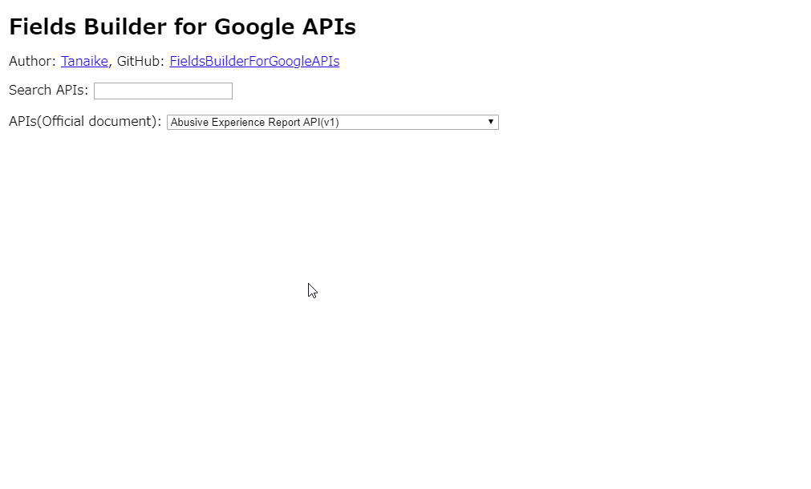

# Fields Builder For Google APIs

# Overview

**[FieldsBuilderForGoogleAPIs](https://sites.google.com/view/fields-builder) is a Web Application for building the fields value for using Google APIs. This is mainly used for developing the scripts for using Google APIs.**

# Demo

# Description

After the API explorer was updated, the fields of APIs cannot be created by the web interface. But it is important for using the fields property. Because when the fields property is used, only the required values can be retrieved. This leads to the low cost. And even when `*` is used, there are some cases that all fields cannot be retrieved. So I created this as a Web Application. This web application can run with the standalone. No authorization and no scopes are required. This only creates the fields value for Google APIs.

This web application can use for almost Google APIs. But, in the current stage, unfortunately, this cannot be used for all Google APIs because of several issues. Please be careful this. I have to apologize for this.

# URL of this web application

[https://sites.google.com/view/fields-builder](https://sites.google.com/view/fields-builder)

---

# Licence

[MIT](LICENCE)

# Author

[Tanaike](https://tanaikech.github.io/about/)

If you have any questions and commissions for me, feel free to tell me.

# Update History

- v1.0.0 (March 4, 2020)

  1. Initial release.

[TOP](#top)
